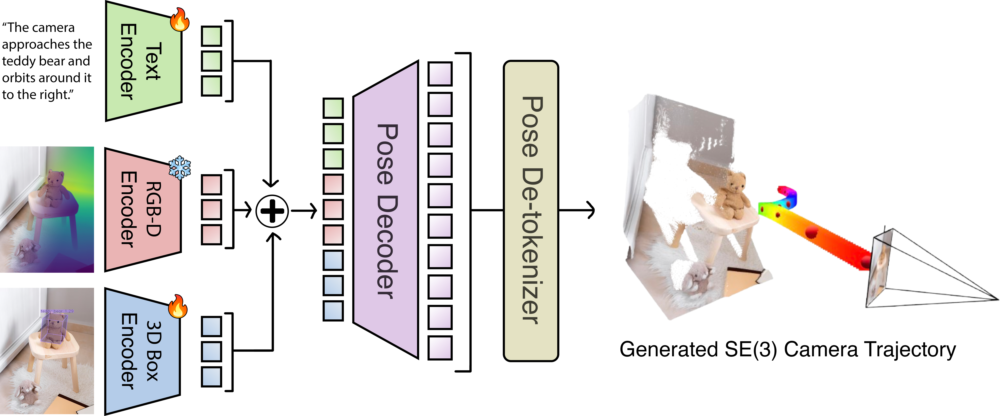

# Subject-Driven Camera Trajectories from a Single Image

Quantitative results to be added here soon...

  

  
Much of the code for our model is adapted from the GenDoP implementation: https://github.com/3DTopia/GenDoP
